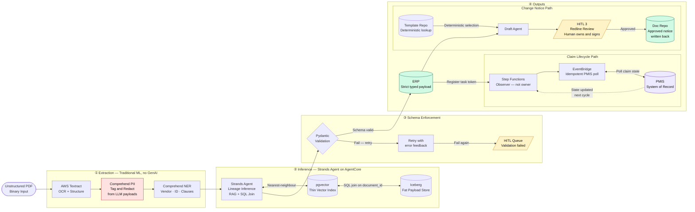
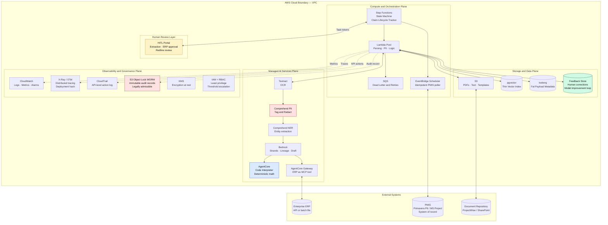

# AI-Enabled Commercial Change Management
### Senior Solution Architect — Operational AI | AECOM Take-Home Assignment

---

## Repository Contents

```
├── README.md                          # This file — diagrams + architecture decision log
├── Solution_v8.md                     # Full technical solution document
└── presentation/
    └── AECOM_AI_Change_Management.pptx
```

> **Diagrams** are embedded below as Mermaid — rendered natively by GitHub, no plugins required.

---

## Solution Summary

An agentic, batch-mode AI pipeline that detects tariff change signals in unstructured contracts, quantifies cost and schedule impact, drafts change notices for human review, and integrates with PMIS and ERP systems — with graduated human oversight at every consequential decision point.

**Core design principles:**
- AI extracts and infers; humans approve and sign
- LLMs never touch financial arithmetic
- Autonomy is earned through measured override rates, not assumed
- PMIS is the system of record; the pipeline is an observer

---

## Diagram 1 — Data Flow Lifecycle

End-to-end data payload transformation from unstructured contract to governed ERP entry, change notice draft, and claim lifecycle tracking.



---

## Diagram 2 — Orchestration Options

Two viable orchestration strategies with explicit tradeoffs.

```mermaid
flowchart TB
    subgraph OPT1 ["Option 1 — AWS Step Functions  (explicit state, full auditability)"]
        direction LR
        O1_IN([Contract PDF])
        O1_TEX["Textract + PII Pass"]
        O1_NER["Comprehend NER"]
        O1_PMIS[("PMIS\nProject Record")]
        O1_AGT["Bedrock Agent\nChange Extraction"]
        O1_H1{{"HITL 1\nExtraction Review"}}
        O1_IMP["Impact Assessment\nCode Interpreter"]
        O1_H2{{"HITL 2\nERP Approval"}}
        O1_ERP[("ERP Update")]
        O1_DRAFT["Draft Agent\n+ Template Lookup"]
        O1_H3{{"HITL 3\nRedline Review"}}
        O1_CL["Claim Lifecycle\nEventBridge poller"]

        O1_IN --> O1_TEX --> O1_NER --> O1_PMIS --> O1_AGT
        O1_AGT -->|"Wait for task token"| O1_H1
        O1_H1 -->|"Approved"| O1_IMP
        O1_IMP -->|"Wait for task token"| O1_H2
        O1_H2 -->|"Approved"| O1_ERP
        O1_ERP --> O1_DRAFT
        O1_DRAFT -->|"Wait for task token"| O1_H3
        O1_ERP --> O1_CL
    end

    subgraph OPT2 ["Option 2 — AWS Strands + AgentCore  (managed infra, faster delivery)"]
        direction LR
        O2_IN([Contract PDF])
        O2_AGT(["Strands Supervisor Agent\nAgentCore Runtime — serverless MicroVM"])

        subgraph O2_TOOLS ["Agent Tools — called dynamically"]
            direction TB
            O2_T1["Textract + PII"]
            O2_T2["PMIS Context\nLineage RAG"]
            O2_T3["Code Interpreter\nDeterministic math"]
            O2_T4["ERP MCP Tool\nAgentCore Gateway"]
            O2_T5["Template Retrieval\nDeterministic lookup"]
            O2_T6["PMIS Poller\nEventBridge"]
        end

        O2_HITL[/"Amazon Q Apps\nHITL UI — all 3 touchpoints"/]

        O2_IN --> O2_AGT
        O2_AGT <--> O2_T1
        O2_AGT <--> O2_T2
        O2_AGT <--> O2_T3
        O2_AGT <--> O2_T4
        O2_AGT <--> O2_T5
        O2_AGT <--> O2_T6
        O2_AGT <-->|"Pause for HITL x3"| O2_HITL
    end

    subgraph TRADEOFFS ["Tradeoff Summary"]
        direction LR
        TR1["Option 1\n✅ Explicit state machine — full audit trail\n✅ Deterministic step sequencing\n✅ SQS-backed retry on every hop\n⚠️ More infra to manage\n⚠️ Lambda orchestration overhead"]
        TR2["Option 2\n✅ Serverless — no ECS or Lambda management\n✅ Faster delivery via managed runtime\n✅ Native MCP tool integration\n⚠️ Agentic loop harder to audit step-by-step\n⚠️ AgentCore regional availability risk"]
    end

    style O2_HITL fill:#fef3c7,stroke:#d97706,color:#111
    style O1_H1 fill:#fef3c7,stroke:#d97706,color:#111
    style O1_H2 fill:#fef3c7,stroke:#d97706,color:#111
    style O1_H3 fill:#fef3c7,stroke:#d97706,color:#111
```



---

## Diagram 3 — Infrastructure Deployment (Option 1: Step Functions)

Plane-based view of all AWS services, their roles, and cross-plane connections.



---

## Architecture Decision Log

Each entry records the decision, the rationale, and the tradeoffs explicitly considered.

---

### ADR-001: Traditional ML First, Generative AI Only Where Needed

**Decision:** Use Amazon Textract (computer vision) and Amazon Comprehend Custom NER (traditional NLP) for the initial extraction passes. Reserve Bedrock LLMs only for lineage inference and change notice drafting.

**Rationale:** Traditional ML models are deterministic, cheaper per token, lower latency, and more auditable for extraction tasks where the answer space is well-defined. GenAI adds cost and probabilistic risk without benefit when extracting structured entities from known document schemas.

**Tradeoff accepted:** Two-model pipeline adds architectural complexity. Accepted because the cost and risk reduction outweighs the complexity.

**Alternatives considered:** Single end-to-end LLM pipeline (rejected — token cost, latency, and hallucination risk on extraction tasks).

---

### ADR-002: LLMs Must Never Perform Financial Arithmetic

**Decision:** All unit conversions, cost delta calculations, and aggregations are executed by deterministic Python code in the AgentCore Code Interpreter sandbox. The LLM writes the code; it does not compute the result.

**Rationale:** LLMs are probabilistic. Financial figures in ERP systems must be exact and reproducible. A $1 rounding error on a $500M contract has legal consequences. The Code Interpreter provides a 100% deterministic mathematical outcome with a verifiable execution trace.

**Tradeoff accepted:** Additional hop in the pipeline. Accepted unconditionally — no financial risk tolerance exists for this constraint.

---

### ADR-003: Schema Enforcement Pipeline with Deterministic Fallback

**Decision:** Every LLM output is immediately validated against a Pydantic schema. On failure: one automatic retry with the error message fed back. On second failure: route to Human Review queue. No malformed data ever reaches the ERP integration layer.

**Rationale:** Enterprise ERP systems require deterministic typed inputs. Probabilistic LLM outputs cannot be trusted to self-conform. The retry provides one opportunity for the model to self-correct before human escalation.

**Tradeoff accepted:** Retry adds latency on failure cases. Acceptable given the batch-async architecture — no synchronous SLA exists for individual documents.

---

### ADR-004: Thin Vector, Fat Payload RAG Pattern

**Decision:** The vector database (Aurora pgvector) stores only the embedding vector and a foreign key (`document_id`). Full metadata is stored in Apache Iceberg tables. The agent retrieves nearest-neighbor document IDs from the vector store, then executes a deterministic SQL join to retrieve verified metadata.

**Rationale:** Storing full payloads in the vector store conflates semantic search (approximate) with factual lookup (exact). Using the vector store as a secondary index preserves semantic retrieval while ensuring that the data used for lineage inference is always the verified, authoritative record — not a vector-approximate reconstruction.

**Tradeoff accepted:** Two-store architecture. Accepted because data integrity on lineage inference directly affects ERP payload accuracy.

---

### ADR-005: Deterministic Template Selection for Change Notice Drafting

**Decision:** Change notice template retrieval uses a deterministic structured lookup against contract type, jurisdiction, and counterparty attributes from the PMIS project master record. It is not a semantic similarity search.

**Rationale:** Template selection is a classification problem with a known, finite answer space defined by the project record. Using semantic search introduces the risk of retrieving a plausible-but-wrong template. The correct template for a UK subcontract must be the UK subcontract template — not the most semantically similar document in the repository.

**Tradeoff accepted:** Requires PMIS project record to be complete and accurate at time of processing. If the project record is incomplete, template selection fails deterministically and routes to HITL — which is the correct behavior.

---

### ADR-006: Data Residency Inherited from PMIS Project Record, Not Inferred

**Decision:** AWS region routing for data residency is determined by the project master record in PMIS, applied at the point of human document submission. AI never determines data residency.

**Rationale:** Determining residency from document content requires processing the document first — a circular dependency. The PMIS project record is the authoritative source for project attributes including jurisdiction. Residency from document content also introduces risk of misclassification on international or multi-jurisdiction contracts.

**Tradeoff accepted:** Requires the PMIS project record to have a valid country/region attribute before submission. A missing attribute fails deterministically and prompts the submitting user to correct it.

---

### ADR-007: Step Functions as Claim Lifecycle Observer, Not Owner

**Decision:** The Step Functions state machine tracks the system's view of claim state via idempotent EventBridge polling of the PMIS workflow API. The Step Function does not own the lifecycle — PMIS does.

**Rationale:** Claim lifecycle management is an established PMIS capability. Duplicating ownership across two systems creates data consistency risk and change management overhead. The correct role for the pipeline is to initiate, observe, and react — not to own.

**Consistency model:** Eventually consistent. A missed poll cycle catches up on the next scheduled execution. This is an acceptable tradeoff for a batch-async architecture with no real-time claim state SLA.

**Tradeoff accepted:** Loss of real-time state visibility between poll cycles. Acceptable because claim state transitions in PMIS are typically hours-to-days, not seconds.

---

### ADR-008: Immutable Audit Records Separate from Operational Logs

**Decision:** A distinct write-once audit record per document is stored in S3 with Object Lock (WORM) enabled. This is separate from OTel traces and CloudWatch logs.

**Rationale:** OTel traces are operational — rotated, compressed, and designed for debugging. Legal proceedings require a different artifact: a human-readable, tamper-evident record of what the AI produced, what the human changed, and who approved each step. These are different retention periods, different access patterns, and different admissibility requirements.

**Tradeoff accepted:** Additional storage and write overhead per document. Accepted — the storage cost is negligible relative to the legal risk of inadequate audit trails on contract claims.

---

### ADR-009: Threshold Escalation is Contract-Relative, Not Absolute

**Decision:** Escalation thresholds are defined as a percentage of total contract value, with a floor absolute dollar amount, both inherited from the PMIS project master record.

**Rationale:** A $500K change on a $2M contract is a fundamentally different risk profile from a $500K change on a $500M contract. Absolute dollar thresholds produce systematic under-escalation on small contracts and over-escalation on large ones. Contract-relative thresholds are also configurable per client, contract type, and jurisdiction without code changes.

**Tradeoff accepted:** Requires contract value to be present in the PMIS project record. A missing contract value fails deterministically to HITL.

---

### ADR-010: Evaluation Framework is Continuous, Not Pre-Production Only

**Decision:** The golden dataset and evaluation metrics are maintained as a living system. Human overrides in production are written to a Feedback Store and periodically promoted into the golden dataset. Metrics are measured per pipeline stage, not as a single system-level F1 score.

**Rationale:** A static pre-production benchmark becomes stale as contract language evolves. Distribution shift manifests first in rising production override rates — before it appears in offline benchmark scores. Layered per-stage metrics enable precise failure attribution when accuracy degrades.

**Production thresholds:**
- Extraction F1 > 0.92 before Phase 1 HITL deployment
- ERP payload exact match > 0.85 before any autonomy is granted
- Human override rate < 5% sustained over 30 days before autonomy gate opens

**Tradeoff accepted:** Requires ongoing data engineering effort to maintain the feedback loop. Accepted — the alternative is model drift with no detection mechanism.

---

## Key Technical Dependencies

| Dependency | Required By | Risk |
|---|---|---|
| PMIS API documentation + sandbox | Phase 1 | High — design file-based fallback from day one |
| ProjectWise / SharePoint API | Phase 1 | Medium — S3 fallback available |
| Legal sign-off on AI-assisted drafting workflow | Phase 2 gate | High — involve legal in Phase 1 shadow review |
| AgentCore availability in target AWS regions | Phase 1 | Medium — validate for non-US deployments |
| Historical contract corpus with verified ERP ground truth | Pre-Phase 1 | High — domain expert audit required before construction |

---

## Phased Rollout

| Phase | Window | Gate Criterion |
|---|---|---|
| 1 — Shadow Mode | Weeks 1–8 | Extraction F1 > 0.92 · ERP exact match > 0.85 |
| 2 — Controlled Autonomy | Weeks 9–20 | 30-day override rate < 5% on Phase 1 contract type |
| 3 — Scaled Deployment | Week 21+ | No degradation in override rate trend over 60 days |

---

*Prepared for AECOM Operational AI — Senior Solution Architect interview process, April 2026.*
